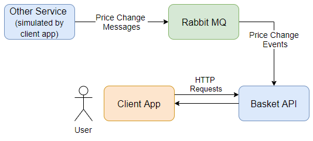

# Basket API

## Introduction
This is a prototype of a shopping basket microservice.  
It demonstrates an outside client using HTTP requests to interact with a shopping basket.  
It also demonstrates asynchronous communication between services using a message broker.

## What's included
- **Basket.API** - The prototype microservice.
- **ClientApp** - A client that makes requests to the Basket API, and posts price changes to the message broker.
- **EndToEndTests** - A testing project that tests all endpoints of the API.
- **EventBusCore** - Holds some basic shared code for the event bus.
- **RabbitMQEventBus** - A rabbitmq event bus implementation.  Used by ClientApp to send price changes and by Basket.API to recieve them.
- **Travis CI Build** - Restores all projects, builds, and runs the tests.

## Running the prototype
- Clone this repository.
- Run `docker-compose build`.
- Run `docker-compose up`.
- Navigate to the URLs listed below.

Another option:
- Loading the project in Visual Studio.
- Start the debugger with docker-compose.
- This should load the Basket API swagger page.

3 containers should be created:
- **basketapi** - http://localhost:55311/swagger/index.html
- **clientapp** - http://localhost:55322/swagger/index.html
- **rabbit** - http://localhost:15672/#/
  - Management page for monitoring.
  - Username: guest
  - Password: guest

This solution was developed on Windows 10, using:
- Visual Studio 15.7.4
- .NET Core SDK 2.1.301
- Docker 18.03.1 using Linux containers.
- RabbitMQ 3.7.6 from Docker.

## Using the API
- The swagger page for the Basket API shows all of the actions available to users of the API.
- The swagger page for the ClientApp shows how a potential user could use the API.
- The Client App can simulate another service changing the price of a product. This publishes a price change event to a message broker.  The Basket API is subscribed to this broker and will update the price of this product in any basket it happens to be in.
- The Client App also demonstrates the use of the circuit breaker pattern.  This can be seen by disabling the Basket API container and making a few requests from the client app.  Once the Basket API is turned back on, requests will resume after 1 minute.  

## Current issues
As I do not have a lot of experience with Docker and RabbitMQ, I encountered the following issues:
- HTTPS is not enabled for the service.  I could run all services using HTTPS but the ClientApp was unable to send requests to the Basket API.  It is very likely I simply have a docker configuration issue.
- I occasionally need to restart Docker once after booting into Windows, before my debug build can create all of my containers.
- On the first run, RabbitMQ fails to connect once or twice.  It succeeds after that.  I'm assuming it is simply not up and running yet.
- The testing project disables the event bus, as it is usually not running when I execute tests during development.  I would like to investigate running tests using docker so I can send test messages to the queue.

